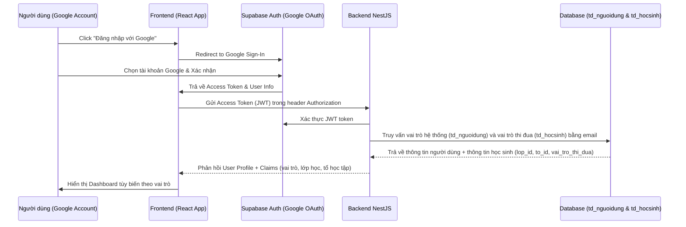

# Quy trình & Luồng Nghiệp vụ: ThiDuaHS

Tài liệu này đặc tả các luồng nghiệp vụ cốt lõi của hệ thống chấm điểm thi đua học sinh, bao gồm quy trình ánh xạ quyền khi đăng nhập, nghiệp vụ chấm điểm hàng ngày, cơ chế tự động khóa sổ chốt điểm tuần lúc 22h00 thứ Sáu, và tổng hợp điểm tháng.

---

## 1. Luồng Xác thực & Ánh xạ Phân quyền
Do hệ thống sử dụng Google OAuth (thông qua Supabase Authentication), quy trình nhận diện quyền của người dùng diễn ra như sau:

### Chi tiết ánh xạ quyền:
- **Nếu email đăng nhập có trong bảng `td_nguoidung` với `vai_tro_he_thong = 'Admin'`**: Người dùng có quyền truy cập trang Admin để cấu hình toàn bộ hệ thống.
- **Nếu email đăng nhập nằm trong bảng `td_hocsinh`**:
  - Hệ thống lấy ra các thông tin: Lớp học (`lop_id`), Tổ (`to_id`), và Vai trò thi đua (`vai_tro_thi_dua` - Lớp trưởng, Lớp phó, Tổ trưởng, Tổ phó, Học sinh).
  - Tải cấu hình phân quyền từ bảng `td_phanquyen` của lớp tương ứng để kiểm soát các nút bấm chấm điểm trên giao diện Frontend và bảo vệ API ở Backend.
- **Nếu email không khớp**: Người dùng được coi là khách (Guest) hoặc chưa được kích hoạt tài khoản học sinh. Hệ thống sẽ báo lỗi và yêu cầu liên hệ Giáo viên/Admin để thêm học sinh vào danh sách lớp trước.

---

## 2. Nghiệp vụ Chấm điểm Thi đua
Quy trình ghi nhận điểm thi đua hàng ngày diễn ra như sau:

1. **Khởi tạo dữ liệu**:
   - Mỗi tuần bắt đầu, mỗi học sinh có sẵn **100 điểm mặc định**.
2. **Ghi nhận điểm (Chấm điểm)**:
   - Ban cán sự lớp truy cập mục **"Chấm điểm thi đua"**.
   - Giao diện hiển thị danh sách học sinh thuộc phạm vi được chấm (ví dụ: Tổ trưởng Tổ 1 chỉ thấy thành viên Tổ 1; Lớp trưởng thấy toàn lớp).
   - Chọn học sinh cần chấm -> Chọn tiêu chí thi đua (ví dụ: Đi muộn, Không đeo khăn quàng, Phát biểu xây dựng bài...) -> Nhập mô tả chi tiết vi phạm (ví dụ: "Muộn 10 phút") -> Tải ảnh minh chứng (nếu có) -> Bấm **"Lưu"**.
3. **Validation ở Backend**:
   - Backend NestJS kiểm tra thời gian hiện tại. Nếu thời gian đã vượt quá **22h00 thứ Sáu của tuần hiện tại**, API sẽ trả về lỗi: `Tuần học đã bị khóa, không thể chấm điểm hoặc sửa đổi.`
   - Kiểm tra xem người chấm có quyền chấm học sinh đó không dựa trên bảng `td_phanquyen`.

---

## 3. Cơ chế Tự động Khóa sổ Chốt điểm Tuần
Để đảm bảo tính minh bạch, tránh việc ban cán sự lớp "chấm bù", chỉnh sửa điểm sau khi tuần học kết thúc hoặc sửa đổi điểm số có lợi cho cá nhân, hệ thống áp dụng cơ chế tự động khóa sổ:

- **Thời điểm**: Đúng **22h00:00 tối thứ Sáu hàng tuần** (Giờ Việt Nam, tức `UTC+7`).
- **Hoạt động của Cron Job**:
  - Hệ thống chạy một tiến trình ngầm (sử dụng `@nestjs/schedule` ở backend hoặc Postgres PgCron ở database).
  - **Bước 1**: Lấy danh sách tất cả học sinh đang hoạt động.
  - **Bước 2**: Tính toán tổng điểm cộng (`tong_diem_cong`) và tổng điểm trừ (`tong_diem_tru`) của từng học sinh từ thứ Bảy tuần trước đến trước 22h00 thứ Sáu tuần này.
  - **Bước 3**: Tính điểm cuối cùng: `diem_cuoi_cung = 100.00 + tong_diem_cong - tong_diem_tru`.
  - **Bước 4**: Ghi kết quả vào bảng `td_tonghop_tuan` cho tuần học hiện tại.
  - **Bước 5**: Kể từ thời điểm này, mọi request ghi nhận điểm mới (`INSERT` hoặc `UPDATE` trạng thái thành `'BiHuy'`) có `ngay_vi_pham` hoặc `ngay_cham` thuộc tuần vừa chốt đều bị chặn ở tầng database (thông qua check constraint / trigger) hoặc tầng API NestJS.

---

## 4. Nghiệp vụ Tổng hợp & Xếp loại Thi đua Tháng
Cuối mỗi tháng dương lịch (hoặc theo cấu hình tháng thi đua của trường):

1. **Tổng hợp**:
   - Admin truy cập trang **"Tổng kết tháng"** và nhấn **"Tổng hợp điểm tháng"** (hoặc hệ thống chạy tự động vào đêm ngày cuối cùng của tháng).
2. **Công thức tính điểm**:
   - Hệ thống lấy tất cả các bản ghi điểm của học sinh trong bảng `td_tonghop_tuan` có ngày chốt nằm trong tháng cần tổng hợp.
   - Điểm trung bình tháng = `Trung bình cộng (diem_cuoi_cung của các tuần)`.
3. **Xếp loại thi đua cá nhân**:
   - Dựa trên điểm trung bình tháng để xếp loại theo quy chuẩn giáo dục:
     - **Xuất sắc**: Điểm trung bình tháng $\ge 95.00$ và không vi phạm lỗi nghiêm trọng nào.
     - **Tốt**: $85.00 \le$ Điểm trung bình tháng $< 95.00$.
     - **Khá**: $70.00 \le$ Điểm trung bình tháng $< 85.00$.
     - **Trung bình**: $50.00 \le$ Điểm trung bình tháng $< 70.00$.
     - **Yếu / Kém**: Điểm trung bình tháng $< 50.00$.
   - Dữ liệu này sẽ được lưu cố định vào bảng `td_tonghop_thang` để làm căn cứ khen thưởng cuối kỳ/năm học.

---

## 5. Quy trình Hủy điểm chấm sai (Phúc khảo / Sửa sai)
Trong trường hợp ban cán sự lớp chấm nhầm hoặc chấm sai cho học sinh:
- Học sinh gửi phản hồi trực tiếp với Lớp trưởng/Giáo viên chủ nhiệm.
- Nếu được chấp thuận, người có thẩm quyền (Admin hoặc Lớp trưởng - tùy thuộc cấu hình `duoc_duyet_huy_diem` trong `td_phanquyen`) sẽ vào lịch sử chấm điểm, tìm bản ghi sai và bấm **"Yêu cầu hủy"**.
- Trạng thái bản ghi `td_lichsu_chamdiem` sẽ chuyển từ `'HieuLuc'` sang `'BiHuy'`. Điểm số này sẽ không được tính vào tổng điểm tuần.
- **Lưu ý**: Việc hủy điểm này chỉ thực hiện được **trước 22h00 ngày thứ Sáu** của tuần đó. Sau khi đã chốt tuần, không một ai (kể cả ban cán sự lớp) được phép sửa đổi lịch sử chấm điểm, trừ khi có tài khoản Admin cấp cao nhất can thiệp.
