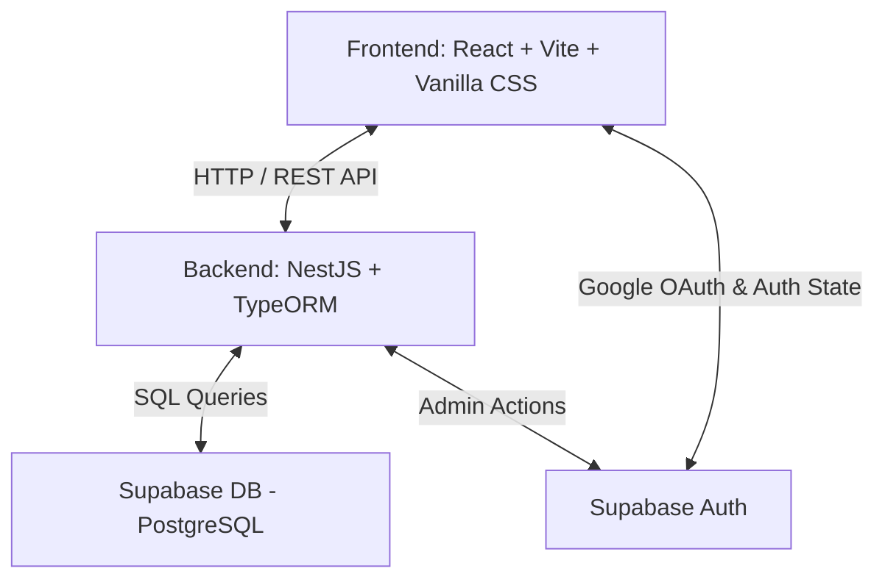

# Tài liệu Cốt lõi Dự án: ThiDuaHS

Hệ thống chấm điểm thi đua học sinh hàng tuần và tổng hợp điểm cá nhân cuối tháng dành cho hệ thống giáo dục Việt Nam.

---

## 1. Giới thiệu Dự án
**ThiDuaHS** là một ứng dụng web (WebApp) nhằm hiện đại hóa công tác chấm điểm thi đua trong trường học tại Việt Nam. Thay vì sử dụng sổ tay giấy hoặc file Excel thủ công, hệ thống cho phép Ban cán sự lớp (Lớp trưởng, Lớp phó, Tổ trưởng, Tổ phó) trực tiếp chấm điểm cho các thành viên trong lớp hàng ngày trên điện thoại hoặc máy tính. Điểm số sẽ được tự động tổng hợp hàng tuần và cuối tháng để xếp loại thi đua của từng học sinh, đảm bảo tính minh bạch, chính xác và kịp thời.

### Mục tiêu chính:
- Chấm điểm thi đua thời gian thực (real-time) theo các tiêu chí nề nếp, học tập, chuyên cần.
- Tự động chốt sổ điểm tuần vào **22h00 tối thứ Sáu hàng tuần**.
- Tổng hợp điểm cá nhân và xếp loại thi đua cuối tháng tự động.
- Cấu hình phân quyền linh hoạt theo mô hình tự quản của học sinh trong lớp.

---

## 2. Liên kết Tài liệu Thiết kế Chi tiết
Mọi khía cạnh kỹ thuật của dự án được mô tả chi tiết trong các tài liệu con sau:
- 📊 **[Thiết kế Cơ sở Dữ liệu](file:///d:/WEBAPP/ThiduaHS/docs/DATABASE.md)**: Chi tiết về các bảng Supabase (tiền tố `td_`), RLS Policies, Triggers và TypeORM Entities.
- ⚙️ **[Quy trình & Luồng Nghiệp vụ](file:///d:/WEBAPP/ThiduaHS/docs/BUSINESS_FLOW.md)**: Luồng Google OAuth, sơ đồ phân quyền lớp học, nghiệp vụ chấm điểm, khiếu nại và cơ chế tự động chốt tuần lúc 22h00 thứ Sáu.
- 🔗 **[Tài liệu API Backend](file:///d:/WEBAPP/ThiduaHS/docs/API.md)**: Định nghĩa các API endpoints của NestJS, cấu trúc request/response, phân quyền API qua Guards.

---

## 3. Kiến trúc Công nghệ & Hệ thống
Dự án được phát triển dưới dạng **Monorepo** chứa cả Frontend và Backend, giúp dễ dàng phát triển và triển khai đồng bộ lên nền tảng **Vercel**.

### Chi tiết Stack công nghệ:
1. **Frontend**:
   - **Framework**: React.js (Vite) với TypeScript.
   - **Styling**: Vanilla CSS (tập trung vào biến CSS variables để quản lý theme, Dark Mode, phong cách Glassmorphic hiện đại, không dùng CSS framework bên thứ ba).
   - **State & Routing**: React Context API (Auth, Theme) & React Router DOM.
   - **Xác thực**: Tích hợp trực tiếp Supabase Client SDK để xử lý đăng nhập Google OAuth.

2. **Backend**:
   - **Framework**: NestJS (sử dụng kiến trúc Modular giúp code sạch và dễ bảo trì).
   - **ORM**: TypeORM để kết nối và thao tác với PostgreSQL database trên Supabase.
   - **Xác thực & Bảo mật**: NestJS AuthGuard xác thực mã JWT token do Supabase Auth cung cấp ở mỗi request.
   - **Tự động hóa**: NestJS Schedule (`@nestjs/schedule`) thiết lập cron job tự động chốt điểm tuần lúc 22h00 thứ Sáu hàng tuần.

3. **Database & Infrastructure**:
   - **Cơ sở dữ liệu**: PostgreSQL lưu trữ trên Supabase cloud.
   - **Authentication**: Supabase Auth (Google Identity).
   - **Hosting**: Vercel (Hỗ trợ cấu hình chạy Frontend tĩnh và Backend API serverless).

---

## 4. Phân rã Vai trò & Quyền hạn
Hệ thống thiết kế một cơ chế phân quyền mềm dẻo cho phép Ban cán sự lớp tự vận hành:

| Vai trò | Phạm vi chấm điểm | Quyền cấu hình hệ thống | Xem báo cáo |
| :--- | :--- | :--- | :--- |
| **Admin** | Không trực tiếp chấm | Toàn quyền cấu hình tiêu chí, tạo lớp, phân công, chốt sổ | Xem toàn trường / toàn lớp |
| **Lớp trưởng** | Toàn bộ học sinh trong lớp | Không | Xem toàn lớp |
| **Lớp phó** | Toàn bộ học sinh trong lớp (hoặc theo mảng phụ trách) | Không | Xem toàn lớp |
| **Tổ trưởng** | Chỉ chấm thành viên trong tổ của mình | Không | Xem thành viên trong tổ |
| **Tổ phó** | Chỉ chấm thành viên trong tổ của mình | Không | Xem thành viên trong tổ |
| **Học sinh** | Không có quyền chấm | Không | Chỉ xem điểm của chính mình |

---

## 5. Quy tắc Phát triển Dự án
Để đảm bảo chất lượng và tính nhất quán theo đúng yêu cầu:
1. **Tài liệu đi trước**: Mọi thay đổi về code phải đi kèm với việc cập nhật các tài liệu trong thư mục `docs/`.
2. **Tiền tố database**: Tất cả các bảng tự tạo bắt buộc phải có tiền tố `td_`.
3. **Thẩm mỹ giao diện**: Giao diện phải mang tính cao cấp (Premium UX), sử dụng Vanilla CSS kết hợp các hiệu ứng đổ bóng mịn, mờ kính (glassmorphism), chuyển động (transition) mượt mà và tương thích tốt trên thiết bị di động (vì học sinh dùng điện thoại rất nhiều).
4. **Viết mã**: Code TypeScript sạch sẽ, cấu trúc rõ ràng, luôn viết comment đầy đủ cho các hàm nghiệp vụ phức tạp.
