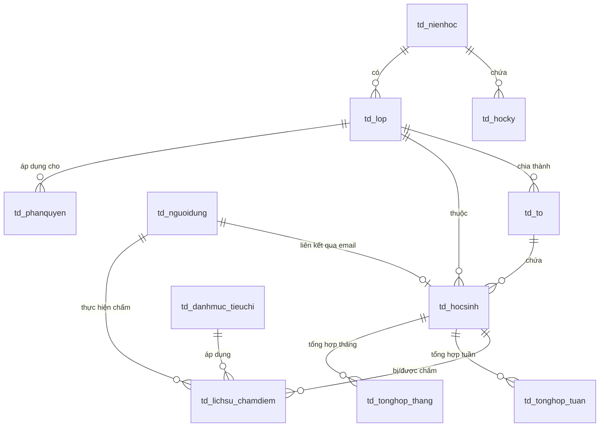

# Thiết kế Cơ sở Dữ liệu: ThiDuaHS

Tài liệu này mô tả chi tiết cấu trúc bảng, mối quan hệ, các ràng buộc và thiết lập RLS (Row Level Security) trên Supabase PostgreSQL, cùng với định nghĩa TypeORM Entities cho Backend NestJS.

---

## 1. Sơ đồ Thực thể Liên kết (ERD - Tóm tắt)
Hệ thống sử dụng các bảng có tiền tố `td_` để lưu trữ dữ liệu thi đua:



---

## 2. Chi tiết các Bảng dữ liệu (tiền tố `td_`)

### 2.1 Bảng `td_nguoidung` (Thông tin tài khoản hệ thống)
Lưu trữ thông tin tài khoản được đồng bộ từ `auth.users` của Supabase.
- **`user_id`**: `UUID` (Primary Key, khớp với `auth.users.id`).
- **`email`**: `VARCHAR(255)` (Unique, không null).
- **`ho_ten`**: `VARCHAR(255)` (Nullable, đồng bộ từ Google profile).
- **`avatar_url`**: `TEXT` (Nullable).
- **`vai_tro_he_thong`**: `VARCHAR(50)` (Default: `'User'`. Giá trị: `'Admin'`, `'User'`).
- **`ngay_tao`**: `TIMESTAMP` (Default: `now()`).

### 2.2 Bảng `td_nienhoc` (Năm học)
- **`nien_hoc_id`**: `INT` (Primary Key, Auto-increment).
- **`ten_nien_hoc`**: `VARCHAR(50)` (Ví dụ: `"2026-2027"`).
- **`ngay_bat_dau`**: `DATE` (Ngày khai giảng dự kiến).
- **`ngay_ket_thuc`**: `DATE` (Ngày bế giảng dự kiến).
- **`trang_thai`**: `BOOLEAN` (Default: `true`. Chỉ một năm học ở trạng thái active tại một thời điểm).

### 2.3 Bảng `td_hocky` (Học kỳ)
- **`hoc_ky_id`**: `INT` (Primary Key, Auto-increment).
- **`nien_hoc_id`**: `INT` (Foreign Key -> `td_nienhoc.nien_hoc_id`, Cascade delete).
- **`ten_hoc_ky`**: `VARCHAR(50)` (Ví dụ: `"Học kỳ 1"`, `"Học kỳ 2"`).
- **`trang_thai`**: `BOOLEAN` (Default: `true`).

### 2.4 Bảng `td_lop` (Lớp học)
- **`lop_id`**: `INT` (Primary Key, Auto-increment).
- **`nien_hoc_id`**: `INT` (Foreign Key -> `td_nienhoc.nien_hoc_id`).
- **`ten_lop`**: `VARCHAR(50)` (Ví dụ: `"10A1"`).
- **`khoi`**: `INT` (Khối lớp: `10`, `11`, `12`...).
- **`gvcn_email`**: `VARCHAR(255)` (Email giáo viên chủ nhiệm để liên kết thông tin nếu cần).

### 2.5 Bảng `td_to` (Tổ trong lớp)
- **`to_id`**: `INT` (Primary Key, Auto-increment).
- **`lop_id`**: `INT` (Foreign Key -> `td_lop.lop_id`, Cascade delete).
- **`ten_to`**: `VARCHAR(50)` (Ví dụ: `"Tổ 1"`, `"Tổ 2"`...).

### 2.6 Bảng `td_hocsinh` (Thông tin Học sinh & Vai trò thi đua)
Học sinh đăng nhập bằng Google OAuth. Hệ thống sẽ kết nối qua `email` để xác định học sinh thuộc lớp nào, tổ nào và giữ chức vụ gì.
- **`hoc_sinh_id`**: `INT` (Primary Key, Auto-increment).
- **`lop_id`**: `INT` (Foreign Key -> `td_lop.lop_id`).
- **`to_id`**: `INT` (Foreign Key -> `td_to.to_id`, Nullable).
- **`ho_ten`**: `VARCHAR(255)` (Họ tên học sinh).
- **`email`**: `VARCHAR(255)` (Unique, Nullable - dùng để khớp khi học sinh đăng nhập Google).
- **`ma_hoc_sinh`**: `VARCHAR(50)` (Unique, mã định danh học sinh).
- **`vai_tro_thi_dua`**: `VARCHAR(50)` (Default: `'HocSinh'`. Các giá trị: `'LopTruong'`, `'LopPho'`, `'ToTruong'`, `'ToPho'`, `'HocSinh'`).

### 2.7 Bảng `td_danhmuc_tieuchi` (Tiêu chí chấm thi đua)
- **`tieu_chi_id`**: `INT` (Primary Key, Auto-increment).
- **`ten_tieu_chi`**: `VARCHAR(255)` (Ví dụ: `"Đi muộn"`, `"Phát biểu xây dựng bài"`, `"Không mang bảng tên"`).
- **`nhom_tieu_chi`**: `VARCHAR(100)` (Nhóm: `"Chuyên cần"`, `"Học tập"`, `"Nền nếp"`, `"Trực nhật"`...).
- **`loai`**: `VARCHAR(10)` (Giá trị: `'Cong'` - Cộng điểm, `'Tru'` - Trừ điểm).
- **`so_diem`**: `DECIMAL(5,2)` (Số điểm cộng/trừ, ví dụ: `2.00`, `5.00`).
- **`trang_thai`**: `BOOLEAN` (Default: `true` - Đang áp dụng).

### 2.8 Bảng `td_lichsu_chamdiem` (Lịch sử ghi nhận chấm điểm)
Ghi nhận chi tiết mỗi lần Ban cán sự lớp chấm điểm thi đua cho học sinh.
- **`lich_su_id`**: `UUID` (Primary Key, Default: `gen_random_uuid()`).
- **`nguoi_cham_id`**: `UUID` (Foreign Key -> `td_nguoidung.user_id`).
- **`hoc_sinh_id`**: `INT` (Foreign Key -> `td_hocsinh.hoc_sinh_id`).
- **`tieu_chi_id`**: `INT` (Foreign Key -> `td_danhmuc_tieuchi.tieu_chi_id`).
- **`so_diem_thuc_te`**: `DECIMAL(5,2)` (Số điểm thực tế áp dụng tại thời điểm chấm).
- **`ngay_vi_pham`**: `DATE` (Ngày xảy ra vi phạm/thành tích - mặc định là ngày hiện tại).
- **`ngay_cham`**: `TIMESTAMP` (Thời điểm bấm lưu trên hệ thống, default `now()`).
- **`mo_ta`**: `TEXT` (Mô tả chi tiết, ví dụ: "Đi muộn 15 phút", "Nhặt được của rơi trả lại người mất").
- **`hinh_anh_minh_chung`**: `TEXT` (Nullable, URL ảnh tải lên Supabase Storage).
- **`tuan_thu`**: `INT` (Số thứ tự tuần học được chốt điểm).
- **`trang_thai`**: `VARCHAR(20)` (Default: `'HieuLuc'`. Giá trị: `'HieuLuc'`, `'BiHuy'` - trường hợp Admin/Lớp trưởng duyệt hủy đầu điểm chấm sai).

### 2.9 Bảng `td_tonghop_tuan` (Tổng hợp điểm cá nhân theo tuần)
Được chốt tự động vào **22h00 tối thứ Sáu hàng tuần** bởi hệ thống.
- **`tong_hop_tuan_id`**: `INT` (Primary Key, Auto-increment).
- **`hoc_sinh_id`**: `INT` (Foreign Key -> `td_hocsinh.hoc_sinh_id`).
- **`hoc_ky_id`**: `INT` (Foreign Key -> `td_hocky.hoc_ky_id`).
- **`tuan_thu`**: `INT` (Số thứ tự tuần học).
- **`diem_mac_dinh`**: `DECIMAL(5,2)` (Mặc định: `100.00`).
- **`tong_diem_cong`**: `DECIMAL(5,2)` (Tổng các điểm cộng được nhận trong tuần).
- **`tong_diem_tru`**: `DECIMAL(5,2)` (Tổng các điểm trừ bị phạt trong tuần).
- **`diem_cuoi_cung`**: `DECIMAL(5,2)` (Công thức: `diem_mac_dinh + tong_diem_cong - tong_diem_tru`).
- **`ngay_chot`**: `TIMESTAMP` (Thời gian chạy chốt điểm).

### 2.10 Bảng `td_tonghop_thang` (Tổng hợp điểm cá nhân theo tháng)
Được tổng hợp từ điểm các tuần trong tháng.
- **`tong_hop_thang_id`**: `INT` (Primary Key, Auto-increment).
- **`hoc_sinh_id`**: `INT` (Foreign Key -> `td_hocsinh.hoc_sinh_id`).
- **`thang`**: `INT` (Tháng tổng kết: `1` -> `12`).
- **`nam`**: `INT` (Năm tổng kết).
- **`diem_trung_binh`**: `DECIMAL(5,2)` (Trung bình cộng điểm cuối cùng của các tuần thuộc tháng đó).
- **`xep_loai`**: `VARCHAR(50)` (Xuất sắc: >= 95, Tốt: 85-94, Khá: 70-84, Trung bình: 50-69, Yếu: < 50).
- **`ngay_tong_hop`**: `TIMESTAMP` (Thời gian tổng hợp).

### 2.11 Bảng `td_phanquyen` (Cấu hình quyền hạn thi đua trong lớp)
Bảng này giúp Admin thiết lập phạm vi chấm điểm của các vai trò Lớp trưởng, Lớp phó, Tổ trưởng, Tổ phó cho từng lớp học cụ thể.
- **`phan_quyen_id`**: `INT` (Primary Key, Auto-increment).
- **`lop_id`**: `INT` (Foreign Key -> `td_lop.lop_id`).
- **`vai_tro_thi_dua`**: `VARCHAR(50)` (Các vai trò: `'LopTruong'`, `'LopPho'`, `'ToTruong'`, `'ToPho'`).
- **`duoc_cham_to_vien`**: `BOOLEAN` (Cho phép chấm học sinh bình thường).
- **`duoc_cham_to_truong`**: `BOOLEAN` (Cho phép chấm các tổ trưởng).
- **`duoc_cham_ngoai_to`**: `BOOLEAN` (Cho phép chấm học sinh ngoài tổ của mình - Lớp trưởng/phó thường mặc định là true, Tổ trưởng thường là false).
- **`duoc_duyet_huy_diem`**: `BOOLEAN` (Quyền duyệt hủy các điểm chấm sai của lớp/tổ).

---

## 3. Script SQL Khởi tạo Cơ sở dữ liệu (Supabase DDL)

Dưới đây là mã SQL chuẩn bị chạy trên Supabase SQL Editor:

```sql
-- Kích hoạt extension UUID
CREATE EXTENSION IF NOT EXISTS "uuid-ossp";

-- 1. Bảng td_nguoidung
CREATE TABLE td_nguoidung (
    user_id UUID PRIMARY KEY,
    email VARCHAR(255) UNIQUE NOT NULL,
    ho_ten VARCHAR(255),
    avatar_url TEXT,
    vai_tro_he_thong VARCHAR(50) DEFAULT 'User' CHECK (vai_tro_he_thong IN ('Admin', 'User')),
    ngay_tao TIMESTAMP WITH TIME ZONE DEFAULT timezone('utc'::text, now()) NOT NULL
);

-- Tự động đồng bộ từ auth.users của Supabase sang td_nguoidung
CREATE OR REPLACE FUNCTION public.handle_new_user()
RETURNS trigger AS $$
BEGIN
  INSERT INTO public.td_nguoidung (user_id, email, ho_ten, avatar_url, vai_tro_he_thong)
  VALUES (
    new.id,
    new.email,
    COALESCE(new.raw_user_meta_data->>'full_name', new.raw_user_meta_data->>'name'),
    new.raw_user_meta_data->>'avatar_url',
    'User' -- Mặc định khi đăng ký mới là User thường
  );
  RETURN new;
END;
$$ LANGUAGE plpgsql SECURITY DEFINER;

-- Trigger đồng bộ
CREATE OR REPLACE TRIGGER on_auth_user_created
  AFTER INSERT ON auth.users
  FOR EACH ROW EXECUTE FUNCTION public.handle_new_user();

-- 2. Bảng td_nienhoc
CREATE TABLE td_nienhoc (
    nien_hoc_id SERIAL PRIMARY KEY,
    ten_nien_hoc VARCHAR(50) UNIQUE NOT NULL,
    ngay_bat_dau DATE NOT NULL,
    ngay_ket_thuc DATE NOT NULL,
    trang_thai BOOLEAN DEFAULT true
);

-- 3. Bảng td_hocky
CREATE TABLE td_hocky (
    hoc_ky_id SERIAL PRIMARY KEY,
    nien_hoc_id INT REFERENCES td_nienhoc(nien_hoc_id) ON DELETE CASCADE NOT NULL,
    ten_hoc_ky VARCHAR(50) NOT NULL,
    trang_thai BOOLEAN DEFAULT true
);

-- 4. Bảng td_lop
CREATE TABLE td_lop (
    lop_id SERIAL PRIMARY KEY,
    nien_hoc_id INT REFERENCES td_nienhoc(nien_hoc_id) ON DELETE RESTRICT NOT NULL,
    ten_lop VARCHAR(50) NOT NULL,
    khoi INT NOT NULL,
    gvcn_email VARCHAR(255)
);

-- 5. Bảng td_to
CREATE TABLE td_to (
    to_id SERIAL PRIMARY KEY,
    lop_id INT REFERENCES td_lop(lop_id) ON DELETE CASCADE NOT NULL,
    ten_to VARCHAR(50) NOT NULL
);

-- 6. Bảng td_hocsinh
CREATE TABLE td_hocsinh (
    hoc_sinh_id SERIAL PRIMARY KEY,
    lop_id INT REFERENCES td_lop(lop_id) ON DELETE RESTRICT NOT NULL,
    to_id INT REFERENCES td_to(to_id) ON DELETE SET NULL,
    ho_ten VARCHAR(255) NOT NULL,
    email VARCHAR(255) UNIQUE,
    ma_hoc_sing VARCHAR(50) UNIQUE, -- (Sửa typo: ma_hoc_sinh)
    vai_tro_thi_dua VARCHAR(50) DEFAULT 'HocSinh' CHECK (vai_tro_thi_dua IN ('LopTruong', 'LopPho', 'ToTruong', 'ToPho', 'HocSinh'))
);
-- Lưu ý: Sẽ dùng cột email này để map quyền thi đua khi người dùng Google OAuth đăng nhập.

-- 7. Bảng td_danhmuc_tieuchi
CREATE TABLE td_danhmuc_tieuchi (
    tieu_chi_id SERIAL PRIMARY KEY,
    ten_tieu_chi VARCHAR(255) NOT NULL,
    nhom_tieu_chi VARCHAR(100) NOT NULL,
    loai VARCHAR(10) CHECK (loai IN ('Cong', 'Tru')) NOT NULL,
    so_diem DECIMAL(5,2) NOT NULL,
    trang_thai BOOLEAN DEFAULT true
);

-- 8. Bảng td_lichsu_chamdiem
CREATE TABLE td_lichsu_chamdiem (
    lich_su_id UUID PRIMARY KEY DEFAULT gen_random_uuid(),
    nguoi_cham_id UUID REFERENCES td_nguoidung(user_id) ON DELETE RESTRICT NOT NULL,
    hoc_sinh_id INT REFERENCES td_hocsinh(hoc_sinh_id) ON DELETE CASCADE NOT NULL,
    tieu_chi_id INT REFERENCES td_danhmuc_tieuchi(tieu_chi_id) ON DELETE RESTRICT NOT NULL,
    so_diem_thuc_te DECIMAL(5,2) NOT NULL,
    ngay_vi_pham DATE DEFAULT CURRENT_DATE NOT NULL,
    ngay_cham TIMESTAMP WITH TIME ZONE DEFAULT timezone('utc'::text, now()) NOT NULL,
    mo_ta TEXT,
    hinh_anh_minh_chung TEXT,
    tuan_thu INT NOT NULL,
    trang_thai VARCHAR(20) DEFAULT 'HieuLuc' CHECK (trang_thai IN ('HieuLuc', 'BiHuy'))
);

-- 9. Bảng td_tonghop_tuan
CREATE TABLE td_tonghop_tuan (
    tong_hop_tuan_id SERIAL PRIMARY KEY,
    hoc_sinh_id INT REFERENCES td_hocsinh(hoc_sinh_id) ON DELETE CASCADE NOT NULL,
    hoc_ky_id INT REFERENCES td_hocky(hoc_ky_id) ON DELETE RESTRICT NOT NULL,
    tuan_thu INT NOT NULL,
    diem_mac_dinh DECIMAL(5,2) DEFAULT 100.00 NOT NULL,
    tong_diem_cong DECIMAL(5,2) DEFAULT 0.00 NOT NULL,
    tong_diem_tru DECIMAL(5,2) DEFAULT 0.00 NOT NULL,
    diem_cuoi_cung DECIMAL(5,2) NOT NULL,
    ngay_chot TIMESTAMP WITH TIME ZONE DEFAULT timezone('utc'::text, now()) NOT NULL,
    CONSTRAINT unique_hocsinh_tuan UNIQUE (hoc_sinh_id, hocky_id, tuan_thu) -- Sửa lỗi gõ hocky_id -> hoc_ky_id
);

-- 10. Bảng td_tonghop_thang
CREATE TABLE td_tonghop_thang (
    tong_hop_thang_id SERIAL PRIMARY KEY,
    hoc_sinh_id INT REFERENCES td_hocsinh(hoc_sinh_id) ON DELETE CASCADE NOT NULL,
    thang INT NOT NULL CHECK (thang BETWEEN 1 AND 12),
    nam INT NOT NULL,
    diem_trung_binh DECIMAL(5,2) NOT NULL,
    xep_loai VARCHAR(50) NOT NULL,
    ngay_tong_hop TIMESTAMP WITH TIME ZONE DEFAULT timezone('utc'::text, now()) NOT NULL,
    CONSTRAINT unique_hocsinh_thang UNIQUE (hoc_sinh_id, thang, nam)
);

-- 11. Bảng td_phanquyen
CREATE TABLE td_phanquyen (
    phan_quyen_id SERIAL PRIMARY KEY,
    lop_id INT REFERENCES td_lop(lop_id) ON DELETE CASCADE NOT NULL,
    vai_tro_thi_dua VARCHAR(50) CHECK (vai_tro_thi_dua IN ('LopTruong', 'LopPho', 'ToTruong', 'ToPho')) NOT NULL,
    duoc_cham_to_vien BOOLEAN DEFAULT true,
    duoc_cham_to_truong BOOLEAN DEFAULT true,
    duoc_cham_ngoai_to BOOLEAN DEFAULT false,
    duoc_duyet_huy_diem BOOLEAN DEFAULT false,
    CONSTRAINT unique_lop_vaitro UNIQUE (lop_id, vai_tro_thi_dua)
);
```

---

## 4. Bảo mật Row Level Security (RLS) trên Supabase

Mỗi bảng sẽ có các chính sách RLS riêng để tránh học sinh này sửa điểm của học sinh khác hoặc xem trái phép:

- **Bảng `td_nguoidung`**:
  - Người dùng đăng nhập chỉ được xem và cập nhật thông tin cá nhân của chính mình.
  - Admin được xem toàn bộ.
- **Bảng `td_hocsinh`, `td_lop`, `td_to`**:
  - Tất cả học sinh đã đăng nhập Google OAuth được phép đọc (SELECT) để biết danh sách lớp, danh sách học sinh.
  - Chỉ Admin mới được thực hiện thay đổi (INSERT/UPDATE/DELETE).
- **Bảng `td_lichsu_chamdiem`**:
  - Chỉ những người dùng có vai trò thi đua nằm trong ban cán sự của lớp đó (Lớp trưởng, Lớp phó, Tổ trưởng, Tổ phó) và tuân thủ cấu hình trong `td_phanquyen` mới được INSERT.
  - Học sinh chỉ được SELECT các dòng chấm điểm có `hoc_sinh_id` của chính bản thân.
  - Ban cán sự lớp được xem toàn bộ lịch sử chấm điểm trong lớp mình.
- **Bảng `td_phanquyen`**:
  - Chỉ Admin mới có quyền thay đổi. Ban cán sự lớp có quyền đọc để kiểm tra quyền hạn.
